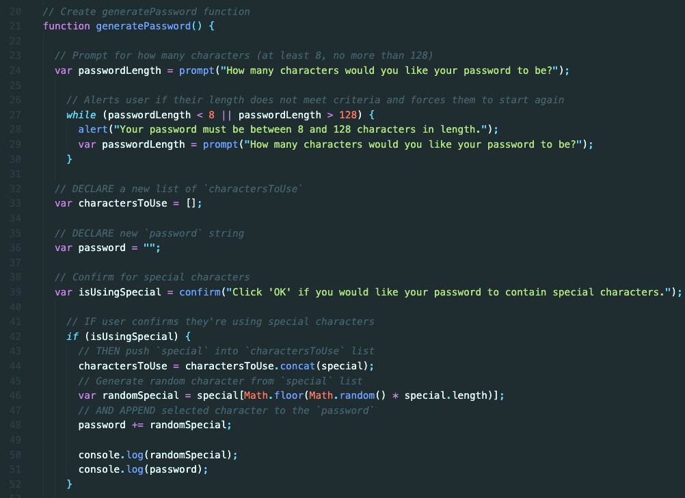
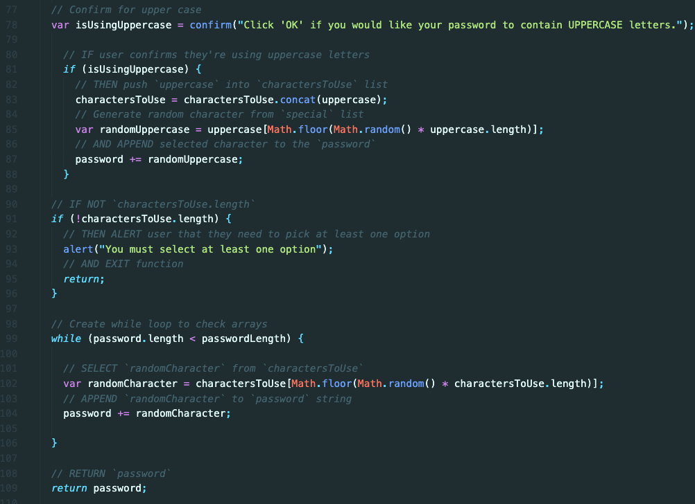
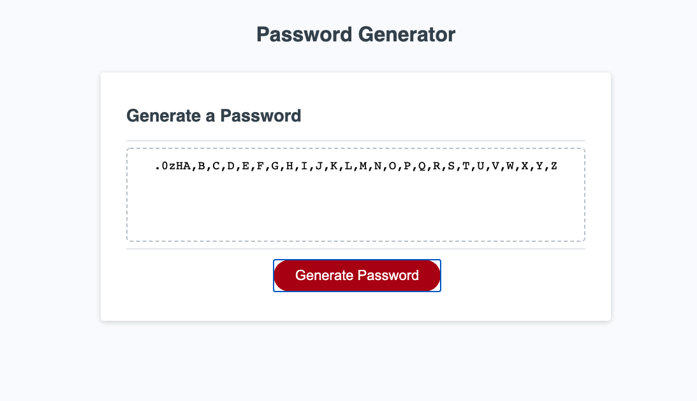
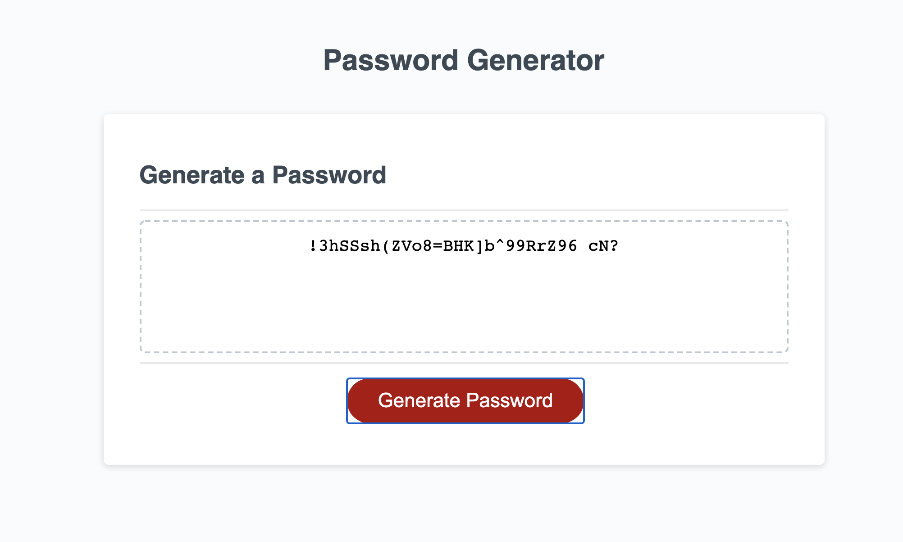

# Password Generator

## Goals for assignment

* Create a randomly generated password through a series of user prompts
    * Allow user to determine the length of their password
        * Password required to be between 8 and 128 characters in length
        * Alert user and return to original question if requirement was not met
    * Ask user which types of characters they wanted in their password
        * Numbers
        * Special Characters
        * Lowercase Letters
        * Uppercase Letters
    * If user responded that they didn't want any characters:
        * User alerted that they must select at least one type
        * Start over
* Display the randomly selected characters on the screen

## Links

* [GitHub Repo](https://github.com/elizabethbrandt/Password-Generator)
* [Deployed Site](https://elizabethbrandt.github.io/Password-Generator/)

## Lessons I learned with this assignment

#### Pseudo coding is VERY helpful!

* Thinking about each step that needed to happen took away the stress of having to remember exactly how the code itself needed to be written and allowed me to paint the picture first
* Also helps you to remember what you still need to work on
* Lets other people see your reasoning for things when they're trying to help you debug

#### While loops

* Kept me from having to create a lot of if/else statements

#### Randomizing from an array

* This is what I struggled with for a while. I was forgetting that even though I created my variable and was defining the length of the array I wanted, I was tying it to which array it should be pulling from.
    * Example: 
        * This is what I started with:
        `var randomUppercase = [Math.floor(Math.random() * uppercase.length)];`
        * This is what I ended up with:
        `var randomUppercase = uppercase[Math.floor(Math.random() * uppercase.length)];`
    * This allowed me to define which array I was randomizing from

#### Concatenating

* I first tried the `push()` method, but when I tried to randomize my final password, it was pulling an entire array instead of the characters inside. I had to concatenate the arrays first in order to combine all the arrays together.

## Final Product

I am happy with the final product as I was able to accomplish all of the required criteria

